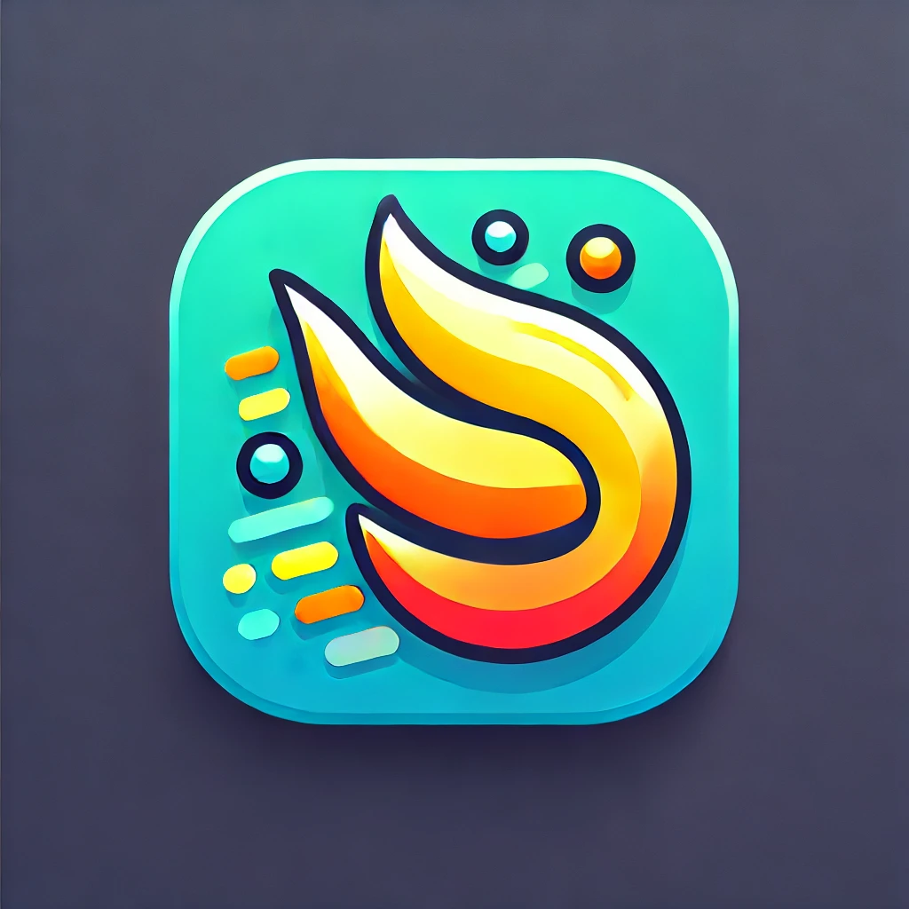

# Streak | 

The application that keeps you motivated.
Looking back, how many times has one thought to oneself, "Oh, I'll do this!" but when it came to down to actually doing it, they couldn't walk the walk? Eh, well, the past is the past! Looking for an app that can help you be honest to yourself? Look no further. Streak is here!

<hr />

### View Streak
Streak has been deployed on our [website](https://cse-210-team-11.github.io/cse210-fa24-group-11/src/pages/home.html). Do check it out!

<hr />

#### Running Streak Locally

> [!NOTE]  
> You should have node.js >= v20.17.0 installed on your system to run Streak locally!

Follow these steps on your Linux\Mac\PC:

``` 
git clone https://github.com/CSE-210-Team-11/cse210-fa24-group-11.git
npm i
npm start
``` 

To generate the test coverage, run:
```
npm test --coverage
```

To check the linting, run:
```
npm run lint
```

To fix biome linting, run:
```
npm run fix
```