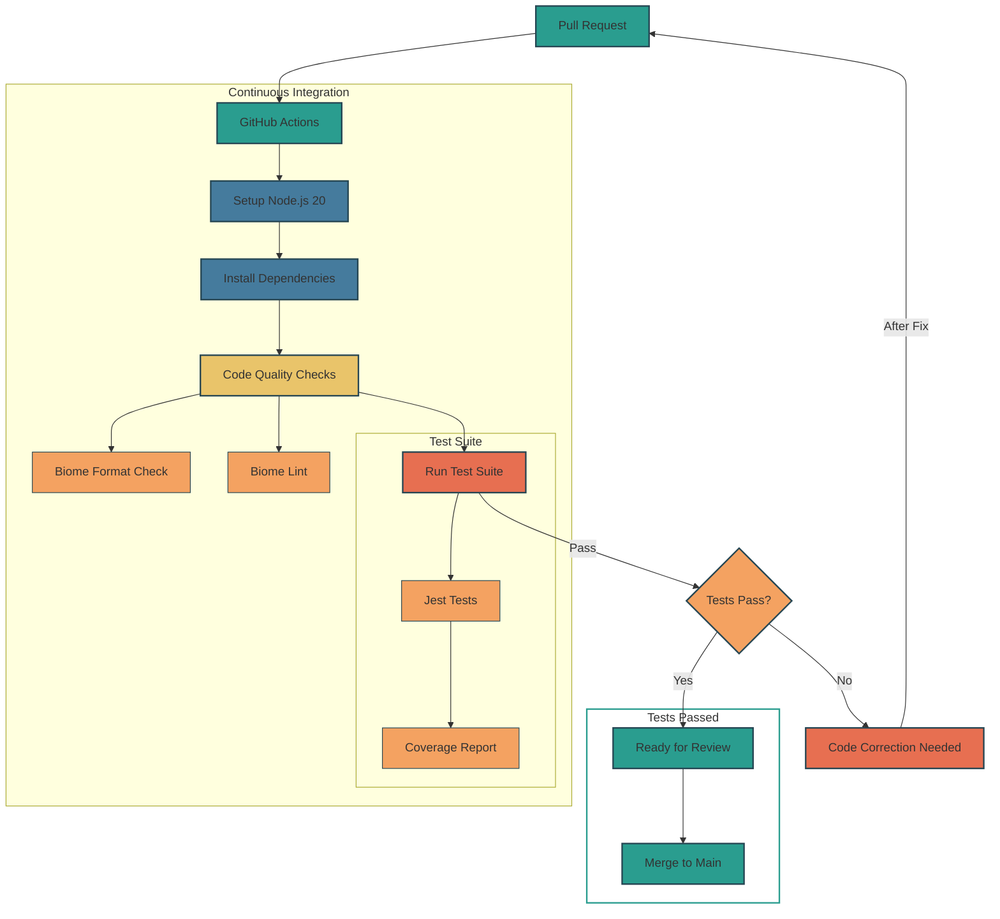

```mermaid
flowchart TD
    %% Pull Request Starts the Process
    PR[Pull Request] --> GHA[GitHub Actions]

    %% Continuous Integration Subgraph
    subgraph "Continuous Integration"
        GHA --> Setup[Setup Node.js 20]
        Setup --> Install[Install Dependencies]
        Install --> Quality[Code Quality Checks]
        Quality --> Format[Biome Format Check]
        Quality --> Lint[Biome Lint]
        Quality --> Tests[Run Test Suite]

        %% Test Suite Subgraph
        subgraph "Test Suite"
            Tests --> Jest[Jest Tests]
            Jest --> Coverage[Coverage Report]
        end
    end

    %% Decision after Tests
    Tests -->|Pass| Decision{Tests Pass?}
    Decision -->|Yes| Review[Ready for Review]
    Decision -->|No| Fix[Code Correction Needed]

    Fix -->|After Fix| PR

    Review --> Merge[Merge to Main]

    %% Outline Box for "Tests Passed"
    subgraph PassedTests["Tests Passed"]
        style PassedTests fill:none,stroke:#2a9d8f,stroke-width:2px
        Review
        Merge
    end

    %% Styling for Visual Clarity
    style PR fill:#2a9d8f,stroke:#264653,stroke-width:2px
    style GHA fill:#2a9d8f,stroke:#264653,stroke-width:2px
    style Setup fill:#457b9d,stroke:#264653,stroke-width:2px
    style Install fill:#457b9d,stroke:#264653,stroke-width:2px
    style Quality fill:#e9c46a,stroke:#264653,stroke-width:2px
    style Format fill:#f4a261,stroke:#264653,stroke-width:1px
    style Lint fill:#f4a261,stroke:#264653,stroke-width:1px
    style Tests fill:#e76f51,stroke:#264653,stroke-width:2px
    style Jest fill:#f4a261,stroke:#264653,stroke-width:1px
    style Coverage fill:#f4a261,stroke:#264653,stroke-width:1px
    style Decision fill:#f4a261,stroke:#264653,stroke-width:2px,shape:diamond
    style Fix fill:#e76f51,stroke:#264653,stroke-width:2px
    style Review fill:#2a9d8f,stroke:#264653,stroke-width:2px
    style Merge fill:#2a9d8f,stroke:#264653,stroke-width:2px


```