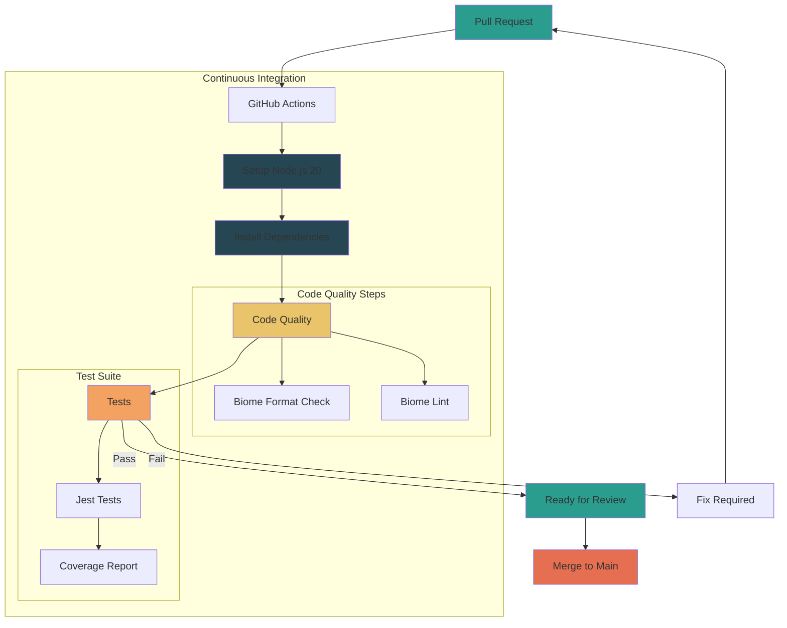

```mermaid
flowchart TD
    PR[Pull Request] --> GHA[GitHub Actions]
    
    subgraph "Continuous Integration"
        GHA --> Setup[Setup Node.js 20]
        Setup --> Install[Install Dependencies]
        Install --> Quality[Code Quality]
        Quality --> Tests[Tests]
        
        subgraph "Code Quality Steps"
            Quality --> Format[Biome Format Check]
            Quality --> Lint[Biome Lint]
        end

        subgraph "Test Suite"
            Tests --> Jest[Jest Tests]
            Jest --> Coverage[Coverage Report]
        end
    end

    Tests -->|Pass| Review[Ready for Review]
    
    Tests -->|Fail| Fix[Fix Required]
    Fix --> PR
    
    Review --> Merge[Merge to Main]
    
    style PR fill:#2a9d8f
    style Setup fill:#264653
    style Install fill:#264653
    style Quality fill:#e9c46a
    style Tests fill:#f4a261
    style Review fill:#2a9d8f
    style Merge fill:#e76f51

```